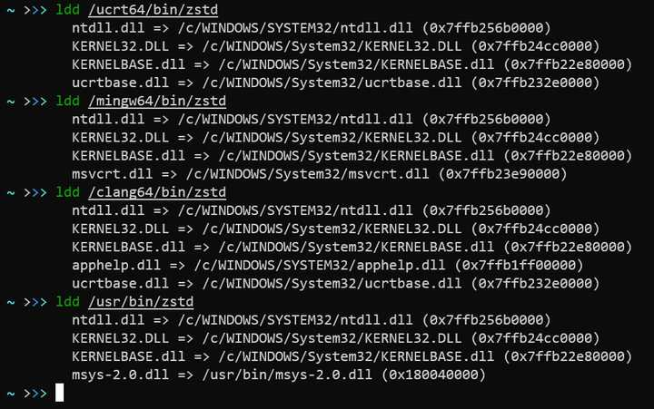

# 在 msys2 中的 mingw64 、 ucrt64 、 clang64 的区别与相同点 #

mingw64/32=msvcrt+libstdc++ +GCC

UCRT64 = UCRT + libstdc++ +GCC

CLANG64 = UCRT + clang + libc++


clang 和 mingw(gcc) 是两个不同的 C/C++ 编译器。

mingw64、ucrt64、clang64 都是 Windows 原生程序（不依赖 cygwin.dll），不过 mingw64 是很早就有的，后两者是最近才新加的，所以只是选一个用的话就 mingw64 就没问题。

后两者先后刚出来时我还查过，简而言之，这三者的区别是：mingw64 与 ucrt64 都是用 mingw64 编译器编译的 Windows 64位程序，只不过它们链接到的 crt（C runtime）不同， mingw64 是链接到了 msvcrt ，而 ucrt64 则是链接到了 Windows 上新的 ucrt 上。

而 clang64 很好理解，就是用 clang 而非 mingw 来编译各种库。另外它也是链接到了 ucrt 而非 msvcrt。

以 zstd 为例：



（ /usr/bin/zstd 就是依赖 cygwin 的非原生程序，这里的 msys-2.0.dll 实际上就是 msys2 版的 cygwin.dll ）

如果你了解 archlinux 的打包的话（如果不了解可以在 archwiki 了解一下），也可以从这几个包的打包脚本（PKGBUILD）来观察区别。msys2 的打包脚本可以在 packages.msys2.org 在线查看。

在这个网站上搜索 zstd 得到这几个 zstd 包的构建脚本，发现这几个 Windows 原生的包其实是共用同一个构建脚本的。从 mingw_arch 变量来看，还有几个32位的包和 arm64 的包也是用这个打包脚本。只不过它会根据不同的 MINGW_PACKAGE_PREFIX 环境变量来执行不同的构建工具、构建出不同的包。

```
mingw_arch=('mingw32' 'mingw64' 'ucrt64' 'clang64' 'clang32' 'clangarm64')
makedepends=("${MINGW_PACKAGE_PREFIX}-gcc"
             "${MINGW_PACKAGE_PREFIX}-ninja"
             "${MINGW_PACKAGE_PREFIX}-cmake")
```

这里是 msys2 最初关于添加 ucrt64 与 clang64 构建的讨论：issue 6901


作者：银河-蜗牛

链接：https://www.zhihu.com/question/463666011/answer/1927907983

来源：知乎

著作权归作者所有。商业转载请联系作者获得授权，非商业转载请注明出处。